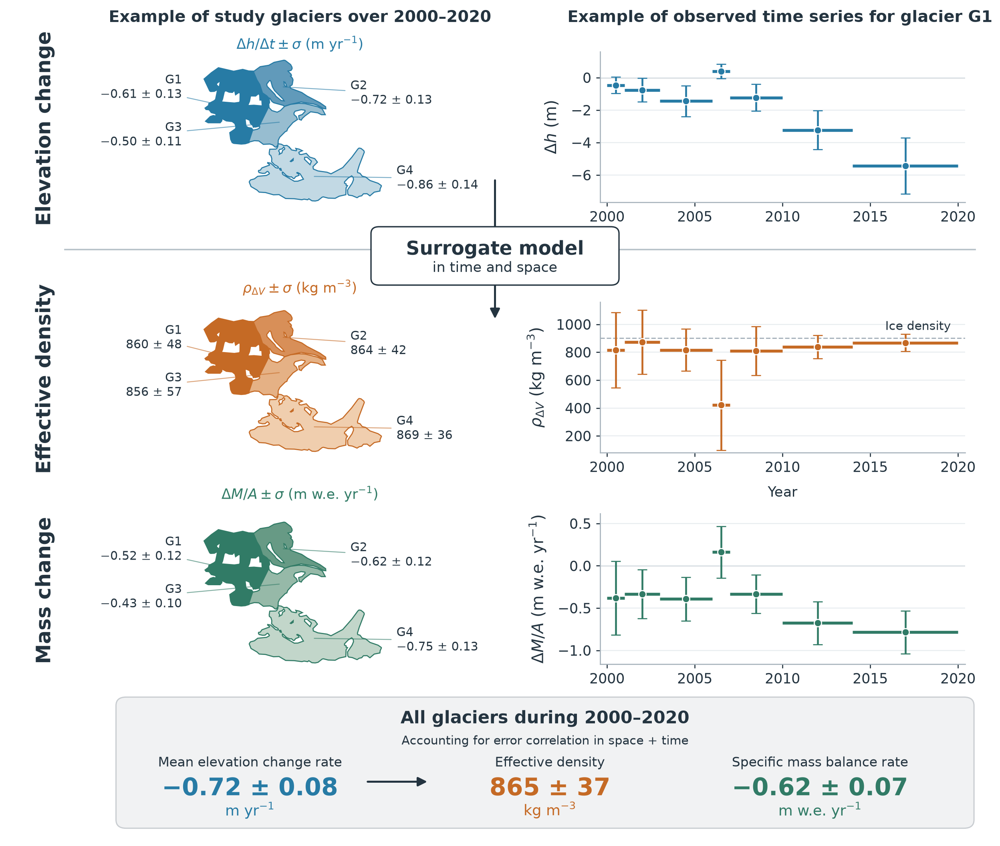
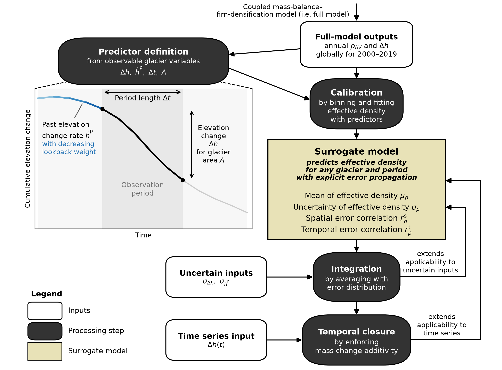

# glacier_density_study

Code for **Huss, Hugonnet, et al., _Converting glacier volume change to mass change: a global assessment_**. :world_map:

This repository contains the study scripts and the surrogate model to predict **effective density**, the quantity to convert glacier volume change to mass change:

$$
\rho_{\Delta V} = \frac{\Delta M}{\Delta V}.
$$

Here, $\Delta M$ is glacier mass change, $\Delta V$ is volume change, and $\rho_{\Delta V}$ is effective density, all referring to a given glacier (or group of glaciers) over a given period.

The dataset containing **outputs of the coupled mass-balance–firn-densification model** required to run the study scripts is available at: [TBC]()

The **surrogate model** is a statistical model calibrated on the full model outputs, allowing to predict effective density and its uncertainty components for little computational effort (virtually instantaneous) without requiring the full model. 
As predictor, it uses glacier-wide elevation change $\Delta h = \Delta V / A$, where $A$ is the glacier area. It accepts a single observation period or an elevation change time series $\Delta h(t)$.

Below a short guide to: use the surrogate, and reproduce the study.

*Example of surrogate model prediction from elevation change time series at 4 glaciers.*




## Use the surrogate

### What is the surrogate?

The surrogate is a statistical model that predicts **glacier-wide effective density and its uncertainty components** from empirical relationships calibrated on the full model.

Its four functions describe the mean $\mu_\rho$, uncertainty $\sigma_\rho$, spatial error correlation $r_\rho^s$, and temporal error correlation $r_\rho^t$:

$$
\mu_\rho(\Delta h, \dot{h}^{p}, \Delta t),
\quad \sigma_\rho(\Delta h, \Delta t),
\quad r_\rho^s(d),
\quad r_\rho^t(\tau).
$$

Along with elevation change over the observed period $\Delta h$ (m), the model uses a weighted past elevation change rate $\dot{h}^{p}$ (m yr⁻¹) and period length $\Delta t$ (yr). Spatial correlation uses separation distance between glaciers $d$ (km), and temporal correlation uses temporal lag between periods $\tau$ (yr). Effective density and its standard deviation are expressed in kg m⁻³.

For uncertain inputs, predictions are integrated over normal error distributions with standard deviations $\sigma_{\Delta h}$ (m) and $\sigma_{\dot{h}^{p}}$ (m yr⁻¹).

It also derives related **mass changes** when glacier area is supplied. For elevation change time series $\Delta h(t)$, the full surrogate also provides estimates for each elemntary period and longer combined periods, **reconciling mass changes automatically** so that they are additive in time. It also **propagates mass change uncertainties** across glaciers and periods accounting for explicit spatial and temporal error correlation.

It aims to **replace older fixed conversions**, such as `850 +/- 60 kg m-3` from [Huss (2013)](https://tc.copernicus.org/articles/7/877/2013/tc-7-877-2013.html), which becomes suboptimal under many conditions.

The package applies the surrogate model formulation as described in the **"Practical application"** Discussion section of the manuscript.

*Illustration of surrogate calibration and application workflow.*



### Setup surrogate environment

Install directly from the GitHub repo (requires Python 3.10+ and Git):

```sh
pip install git+https://github.com/rhugonnet/glacier_density_study.git
```

The installation should work on Windows, Linux and macOS with Python 3.10 and 3.14 (automatically checked in this repository).

If installation fails, it is likely because you have conflicts with your global system Python.
To solve these, create a separate Python environment before running ```pip install```. For example, with Conda:

```sh
conda create -n yourenvname -c conda-forge pip
conda activate yourenvname
```

Or with `venv` on Linux/macOS:

```sh
python3 -m venv .venv
source .venv/bin/activate
```

Or with Anaconda Navigator, create a Python 3.10+ environment via **Environments → Create**, then select **Open Terminal** beside its name and run the install command above.

For development or to run the repository's examples and tests, clone it and install the optional dependencies:

```sh
pip install -e ".[examples,test]"
```

If you still have trouble installing, don't hesitate to open an issue on this repo!

### Quick use

> **Careful!** Apply the surrogate only at glacier scale, never to regional elevation changes. For regional application, predict mass change for each glacier first (with larger uncertainty if extrapolated), then propagate to the region.

**For one glacier and one observation period**, use the CLI (which prints JSON):

```sh
glacier-density-surrogate --dh -1.0 --sigma-dh 0.2 --dt 5 --area-m2 1000000
```

Or Python directly:

```python
from glacier_density_surrogate import RhoSurrogate

model = RhoSurrogate()
out = model.predict(dh=-1.0, sigma_dh=0.2, dt=5, area_m2=1_000_000)
```

That produces the following output:

| `mu_rho_kg_m3` | `sigma_rho_kg_m3` | `dV_m3` | `dM_kg` | `sigma_dM_total_kg` |
| --- | --- | --- | --- | --- |
| 829.1 | 265.1 | -1.000e6 | -8.291e8 | 3.101e8 |

**For an elevation time series**, pass an input CSV file to the CLI (first path), which will write to an output CSV (second path):

```sh
glacier-density-surrogate examples/inputs/dh_timeseries.csv examples/outputs/dh_predictions.csv
```

In Python, pass a pandas DataFrame to `predict_timeseries()`:

```python
import pandas as pd
from glacier_density_surrogate import RhoSurrogate

observations = pd.read_csv("examples/inputs/dh_timeseries.csv")
predictions = RhoSurrogate().predict_timeseries(observations)
predictions.to_csv("examples/outputs/dh_predictions.csv", index=False)
```

Output (first 3 rows, for a single glacier): [dh_predictions.csv](examples/outputs/dh_predictions.csv).

| `start` | `end` | `mu_rho_kg_m3` | `sigma_rho_kg_m3` | `dM_kg` | `sigma_dM_total_kg` |
| --- | --- | --- | --- | --- | --- |
| 2000 | 2001 | 801.9 | 233.2 | -1.103e10 | 4.974e9 |
| 2000 | 2002 | 846.3 | 197.3 | -1.904e10 | 7.140e9 |
| 2000 | 2003 | 969.6 | 264.9 | -1.939e10 | 8.514e9 |

The input fields and units are described in [Input formats](#input-formats) immediately below.

### Input formats

Elevation change is the glacier-wide change over the full observation period, in metres. Negative values should be used for thinning. All `sigma` inputs are 1-sigma uncertainties.

#### Single observation period

For a single observation period, the CLI options and Python arguments expect the same quantities:

| CLI option | Python argument | Quantity | Units |
| --- | --- | --- | --- |
| `--dh` | `dh` | Elevation change over the observation period | m |
| `--sigma-dh` | `sigma_dh` | Elevation change uncertainty | m |
| `--dt` | `dt` | Observation period length | yr |
| `--area-m2` | `area_m2` | Glacier area | m² |
| `--past-dhdt` | `past_dhdt` | Past elevation change rate | m yr⁻¹ |
| `--sigma-past-dhdt` | `sigma_past_dhdt` | Past elevation change rate uncertainty | m yr⁻¹ |

Both `dh` and `dt` are required. Elevation change uncertainty defaults to 0 m.

#### Elevation time series

For a time series, use a CSV file or `pd.DataFrame` with one row per elevation change period for a single glacier. Both use the same columns, for example (first rows of [examples/inputs/dh_timeseries.csv](examples/inputs/dh_timeseries.csv)):

```csv
start_year,end_year,dh_m,sigma_dh_m,area_m2
2000,2001,-0.55,0.18,25000000
2001,2002,-0.35,0.18,25000000
2002,2003,0.10,0.18,25000000
2003,2004,-0.85,0.20,25000000
2004,2005,-0.65,0.20,25000000
```

| Column | Quantity | Units | Required or default |
| --- | --- | --- | --- |
| `start_year` | Start of the observation period | Calendar year, including decimal years | Required with `end_year` |
| `end_year` | End of the observation period | Calendar year, including decimal years | Required with `start_year` |
| `dh_m` | Elevation change over the observation period | m | Required |
| `sigma_dh_m` | Elevation change uncertainty | m | Optional; defaults to 0 |
| `area_m2` | Glacier area | m² | Optional |
| `past_dhdt_m_yr` | Past elevation change rate | m yr⁻¹ | Optional; estimated when missing |
| `sigma_past_dhdt_m_yr` | Past elevation change rate uncertainty | m yr⁻¹ | Optional; estimated when missing |

Passing **glacier area** triggers estimation of volume/mass change in the output. 
Without it, the model returns only effective density and its uncertainty.

For a time series, missing past elevation change rates are estimated from earlier observations. If none are available, including for a single period, the default uses the current elevation change rate, and uncertainty of twice the current rate uncertainty.

#### Aggregating multiple glaciers

To run the model on multiple glaciers, put all glacier observations into one CSV or DataFrame, adding a `glacier_id` or `rgiid` column. For another column name, use `--id-col name` in the CLI or `id_col="name"` in Python.

For regional aggregation, also pass `area_m2`, `lat` and `lon` (coordinates in decimal degrees), required for spatial correlation. An optional `region_group` column defines separate regions; without it, all glaciers form one group. Glaciers in each region must cover the same consecutive elementary intervals, with constant area for each glacier.

See the [in-depth example below](#in-depth-example) for glacier time series and regional aggregation.

### Outputs and options

The output of the predictions contains the final surrogate estimates, including:

* `mu_rho_kg_m3`, `sigma_rho_kg_m3`: effective density and its uncertainty, in kg m⁻³.
* `dV_m3`, `sigma_dV_m3`: volume change and its input uncertainty, in m³, when glacier area is supplied.
* `dM_kg`: mass change, in kg, when glacier area is supplied.
* `sigma_dM_rho_kg`: mass change uncertainty due to effective density uncertainty, in kg.
* `sigma_dM_dh_kg`: mass change uncertainty due to elevation change uncertainty, in kg.
* `sigma_dM_total_kg`: total mass change uncertainty combining the two above, in kg.


Consecutive observation periods produce estimates for longer combined periods, with mass changes reconciled automatically to be additive in time. This requires constant glacier area.

For advanced use, model functions can also be called directly:

* `model.mu_rho(...)`
* `model.sigma_rho(...)`
* `model.integrated_mu(...)`
* `model.integrated_sigma(...)`
* `model.spatial_corr(...)`
* `model.temporal_corr(...)`

### In-depth example

[The figure at the top](examples/figures/surrogate_illustration.png) uses synthetic 2000–2020 elevation changes for four Everest glaciers. Their outlines and areas come from the [RGI Consortium (2017), Randolph Glacier Inventory 6.0](https://www.glims.org/RGI/randolph60.html).

#### 1. Time series: elevation change to effective density

Convert the four glaciers multiannual observations to effective density and mass change in one call. Each glacier is handled independently.

```sh
glacier-density-surrogate examples/inputs/regional_dh_timeseries.csv examples/outputs/glacier_predictions.csv
```

```python
import pandas as pd
from glacier_density_surrogate import RhoSurrogate

model = RhoSurrogate()
observations = pd.read_csv("examples/inputs/regional_dh_timeseries.csv")
predictions = model.predict_timeseries(observations)
```

Output (first 3 rows): [glacier_predictions.csv](examples/outputs/glacier_predictions.csv).

| `glacier_id` | `start` | `end` | `mu_rho_kg_m3` | `sigma_rho_kg_m3` | `dM_kg` | `sigma_dM_total_kg` |
| --- | --- | --- | --- | --- | --- | --- |
| G1 | 2000 | 2001 | 815.5 | 269.6 | -4.821e9 | 5.530e9 |
| G1 | 2000 | 2003 | 851.1 | 174.9 | -1.327e10 | 9.975e9 |
| G1 | 2000 | 2006 | 832.3 | 114.8 | -2.818e10 | 1.475e10 |

#### 2. Spatial aggregation: multiple glaciers to a region

Add a regional output to the same CLI call:

```sh
glacier-density-surrogate examples/inputs/regional_dh_timeseries.csv examples/outputs/glacier_predictions.csv \
  --regional-output examples/outputs/regional_predictions.csv
```

Or aggregate the glacier predictions in Python:

```python
regional = model.aggregate_regions(predictions)
```

Output (first 3 rows): [regional_predictions.csv](examples/outputs/regional_predictions.csv).

| `region_group` | `start` | `end` | `mu_rho_kg_m3` | `sigma_rho_kg_m3` | `dM_kg` | `sigma_dM_total_kg` |
| --- | --- | --- | --- | --- | --- | --- |
| Example region | 2000 | 2001 | 823.5 | 207.9 | -2.037e10 | 1.214e10 |
| Example region | 2000 | 2003 | 857.6 | 134.7 | -5.592e10 | 2.179e10 |
| Example region | 2000 | 2006 | 837.7 | 88.44 | -1.187e11 | 3.204e10 |


The script [run_surrogate_example.py](examples/run_surrogate_example.py) contains all the Python code for the predictions above, and [plot_surrogate_illustration.py](examples/plot_surrogate_illustration.py) to generate the figure. Inputs, outputs and figures are in `examples/inputs/`, `examples/outputs/` and `examples/figures/`.

## Reproduce the study

### Get data and set paths

Download the full models outputs at: [TBC]().

Then point to their folder in `scripts_study_2026/study_paths.py`, for example:

```text
/path/to/input/data/
```

Paths to generate results, figures, tables and diagnostic can be set in the same file.

### Setup environment

A Conda environment file is provided in `scripts_study_2026/environment.yml`:

```sh
conda env create -f scripts_study_2026/environment.yml
conda activate glacier-density
```
### Study scripts

The final pipeline is `scripts_study_2026/run_final_pipeline.py`. It runs the final analysis scripts first, then the scripts for manuscript values, tables and figures.

Individual scripts are located in `scripts_study_2026/analysis/` and `scripts_study_2026/figures/`. Most figure, table and manuscript value scripts require outputs generated by the analysis scripts.

Enjoy! :hourglass_flowing_sand:
