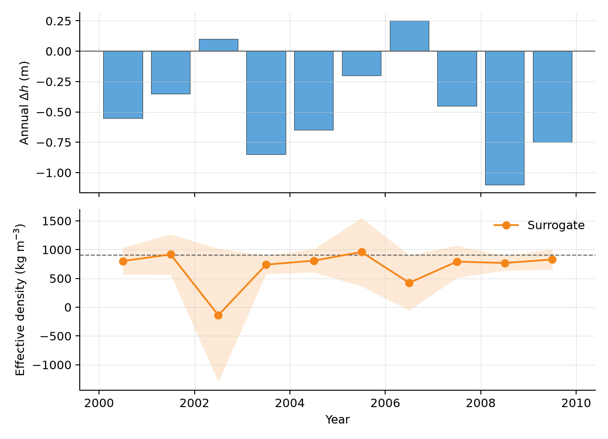

# glacier_density_study

Code for **Huss, Hugonnet, et al., _Converting glacier volume change to mass change: a global assessment_**. :world_map:

This repository contains the study scripts and the package `glacier_density_surrogate` to predict **effective density**, the quantity to convert glacier volume change to mass change, and estimate its uncertainty.

The dataset containing the **outputs of the coupled mass-balance–firn-densification model** required to run the study scripts is available at: TBC

Below a short guide to: use the surrogate, and reproduce the study.

## Use the surrogate

The surrogate predicts **glacier-wide effective density and its uncertainty** from **past and present glacier-wide elevation changes, as well as period length**. It also derives related **mass changes** when glacier area is supplied. Time series are **reconciled automatically** so predicted mass changes close in time. It also **propagates mass change uncertainties** across glaciers and periods accounting for explicit spatial and temporal error correlation.

It aims to **replace older fixed conversions**, such as `850 +/- 60 kg m-3` from Huss (2013), which becomes suboptimal under many conditions.

The package applies the surrogate model formulation as described in the **"Practical application"** Discussion section of the manuscript.

### Setup surrogate environment

Install the package from the repository root:

```sh
python -m pip install -e .
```

To run the scripts in `examples/` or `tests/`, also install the optional dependencies:

```sh
python -m pip install -e ".[study,test]"
```

### Input format

For a glacier time series, use one row per annual or multiannual elevation change period:

```csv
start_year,end_year,dh_m,sigma_dh_m,area_m2
2000,2001,-0.55,0.18,25000000
2001,2002,-0.35,0.18,25000000
2002,2003,0.10,0.18,25000000
2003,2004,-0.85,0.20,25000000
2004,2005,-0.65,0.20,25000000
```

The example file is available in `examples/synthetic_elevation_timeseries.csv`.

**Required columns:**
* `start_year`: start of the observation period.
* `end_year`: end of the observation period.
* `dh_m`: glacier wide elevation change over the period, in metres.
* `sigma_dh_m`: 1 sigma uncertainty of `dh_m`, in metres.

**Optional columns:**
* `area_m2`: glacier area in square metres, needed to derive volume and mass change estimates. If omitted, the model only returns effective density and its uncertainty.
* `past_dh_m`: past elevation change predictor, used to set past change manually. If omitted, the model assumes persistence from the early average elevation change rate.
* `sigma_past_dh_m`: 1 sigma uncertainty of `past_dh_m`.

### Command line interface

Apply the surrogate to a CSV:

```sh
glacier-density-surrogate \
  examples/synthetic_elevation_timeseries.csv \
  examples/synthetic_elevation_timeseries_predictions.csv
```

The output CSV contains the final surrogate estimates, including:
* `mu_rho_kg_m3`, `sigma_rho_kg_m3`
* `dV_m3`, `dM_kg`, `sigma_dM_rho_kg`

For a time series, temporal reconciliation is applied automatically when the input rows are consecutive periods that do not overlap.

Useful options:

```sh
glacier-density-surrogate input.csv output.csv \
  --past-missing current \
  --dh-error-corr-form exponential \
  --dh-error-corr-range 5
```

A single period can also be evaluated directly:

```sh
glacier-density-surrogate --dh -1.0 --sigma-dh 0.2 --dt 5 --area-m2 1000000
```

### Python interface

For one glacier and one observation period:

```python
from glacier_density_surrogate import RhoSurrogate

model = RhoSurrogate()

out = model.predict(
    dh=-1.0,
    sigma_dh=0.2,
    dt=5,
    area_m2=1_000_000,
)

print(out["mu_rho_kg_m3"], out["sigma_rho_kg_m3"])
```

For a time series:

```python
import pandas as pd

from glacier_density_surrogate import RhoSurrogate, make_dh_error_correlation

observations = pd.read_csv("examples/synthetic_elevation_timeseries.csv")
model = RhoSurrogate()

predictions = model.predict_timeseries(
    observations,
    dh_error_corr=make_dh_error_correlation("none"),
)

print(predictions[[
    "start",
    "end",
    "dh_m",
    "mu_rho_kg_m3",
    "sigma_rho_kg_m3",
]])
```

Component model functions can also be called directly:
* `model.mu_rho(...)`
* `model.sigma_rho(...)`
* `model.integrated_mu(...)`
* `model.integrated_sigma(...)`
* `model.spatial_corr(...)`
* `model.temporal_corr(...)`

### Synthetic example

The synthetic example plot is generated from the example CSV with:

```sh
python examples/plot_synthetic_example.py
```



## Reproduce the study

### Data and paths

Set the input data path in `scripts_study_2026/study_paths.py`, for example:

```text
/path/to/input/data/
```

Result, figure, table and diagnostic paths can be set in the same file.

The public data archive and DOI will be added here once the dataset is finalized.

### Setup study environment

A Conda environment file is provided in `scripts_study_2026/environment.yml`:

```sh
conda env create -f scripts_study_2026/environment.yml
conda activate glacier-density
```

The last command installs this repository in editable mode, so changes to `glacier_density_surrogate/` are used immediately by the scripts.

### Study scripts

The final pipeline is `scripts_study_2026/run_final_pipeline.py`. It runs the four final analysis scripts first, then the scripts for manuscript values, tables and figures.

Individual scripts are located in `scripts_study_2026/analysis/` and `scripts_study_2026/figures/`. Most figure, table and manuscript value scripts require outputs generated by the analysis scripts.

Enjoy! :hourglass_flowing_sand:
